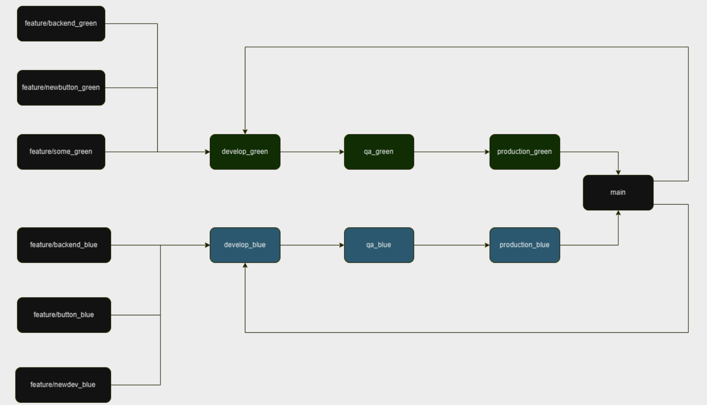
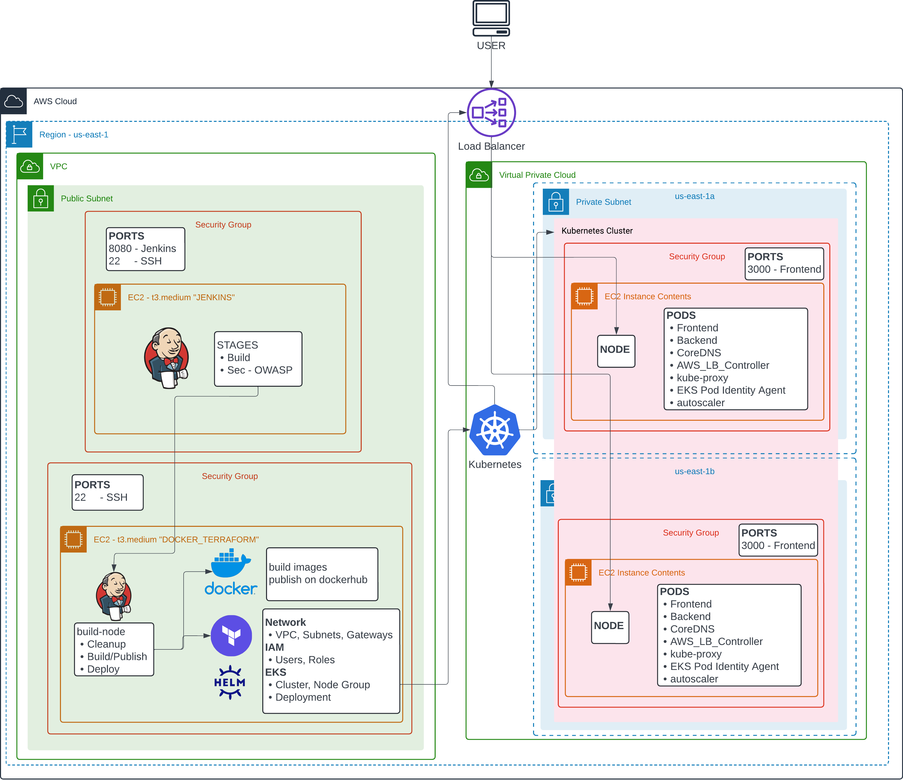

# Farseer

## Purpose

Farseer is an agentic proof of concept designed for automated log analysis in cloud environments. The system leverages modern LLMs to provide intelligent parsing and analysis of various log types, including web server logs, system logs, application logs, and container logs.

This project demonstrates the implementation of a secure, containerized application with Kubernetes integration, making it production-ready with a blue-green deployment strategy.

> This was an entry for Kura Labs final project competition to build and deploy a robust cloud-native application.

## System Architecture

### Core Components

1. Backend Service (Python)
    - REST API, async focus (using FastAPI and uvicorn)
    - Modular manager class supports multiple LLM providers.
    - Handles requests from clients (frontend, cli)
    - API key management through Kubernetes secrets (for production)

2. Frontend Service (TypeScript/React)
    - Web UI for the backend service
    - Handles requests from users (browser)

3. CLI Application (Rust)
    - Command-line interface for the backend service
    - Can use either local or remote backend services
    - Containerized (optional)

### Infrastructure

#### Jenkins/Terraform CI/CD Pipeline

The Jenkins pipeline is responsible for building the application and pushing the relevant image to container image registry, Docker Hub. The app is then deployed to the appropriate Kubernetes cluster. The Terraform configuration is used to provision the necessary resources, such as the AWS EKS cluster itself, the network (VPC, Subnets, Gateways, Availability Zones, Security Groups), as well as Kubernetes namespaces (important for load balancer access), secrets, and Helm charts.

Farseer was deployed to one US region (us-east-1) with two availability zones (us-east-1a and us-east-1b) for the cluster, on a custom VPC with private subnets in each availability zone.

##### Blue-Green Deployment Strategy

The deployment process is triggered by a webhook on code pushed to the repository. With the blue-green deployment strategy, the application benefits from zero downtime deployments. Features and bug fixes are created in separate git branches, and when changes are ready to be merged to into testing, the branch name is used to trigger the appropriate Jenkins build-node actions.

#### Kubernetes Cluster

The Kubernetes cluster is provisioned with the AWS EKS module in Terraform. The cluster is configured with a single nodegroup, which is used to deploy the application.

The nodegroup is configured with the latest Kubernetes version, and the necessary IAM roles and policies are applied to the cluster. Ideally, there would be a nodegroup for each availability zone, but for simplicity, a single nodegroup is used.

When the resources are created by Terraform, Jenkins runs the appropriate [bash scripts](https://github.com/postig0x/farseer-eks-deployment/tree/main/k8s/blue/prod/prod_k8s_setup.sh) to configure the cluster and deploy the application.

##### Pods

1. Frontend (React/Next.JS App)
2. Backend (Python REST API)
3. CoreDNS (for DNS resolution)
4. AWS Load Balancer Controller (for external access)
5. kube-proxy (for internal access)
6. EKS Pod Identity Agent (for pod identity)
7. autoscaler _with `metrics-server`_ (for cluster autoscaling)

Out of these pods, `metrics-server`, `cluster-autoscaler`, and `aws-load-balancer-controller` are deployed as Helm charts.

### Architecture Diagram

## User Experience

The system prompt of an LLM allows you to define the context of the agent's role. For this project, we selected a basic response structure to streamline the user experience. The full system prompt is in `/farseer/backend/routes.py`. The prompt outlines a three section response structure:

- Error Analysis
- Source of Error
- Suggestion to Fix

System prompts can be useful not only for providing context to the LLM, but to structure the response. If the project were to be expanded upon, the system can be more agentic by running actions to correct a deployment based on the logs the system analyzes without user interaction.

## Optimization

Although the app is basic, it can be expanded upon to support agent actions, such as code generation and execution based on the logs the system analyzes.

The cluster nodes currently run both the frontend and backend services, which can be optimized by running the backend service on a separate nodes from the frontend service. This would allow for more efficient resource utilization and better scaling.

The application can be optimized by implementing a database to store the logs and other relevant data. Security would be a concern as well, as the database could potentially be vulnerable to attacks or the data could be sensitive.

Additional security measures could be taken by adding Jenkins steps to scan application code for vulnerabilities (not just OWASP as used in this project).

### Cost

Cost is an important consideration for any cloud-based application, particularly when using a paid service for the application itself. With the increase in popularity of LLMs, the cost of running them is expected to decrease, making them more accessible and less of a barrier to entry for many users or organizations.

At the time of writing, it cost around $0.04 USD for a single query response. This project could benefit from keeping track of the number of tokens being generated to manage cost more accurately.

## Conclusion

Farseer successfully demonstrates the implementation of a modern, cloud-native application that leverages LLM capabilities for log analysis in a production environment. Through its implementation of blue-green deployment strategies, containerization, and Kubernetes orchestration, the project showcases best practices in cloud infrastructure and CI/CD pipelines.

The system's architecture, built with a combination of Rust, Python, and TypeScript, provides a robust foundation for future enhancements while maintaining security and scalability. The use of AWS EKS with multiple availability zones ensures high availability, while the modular approach to LLM integration allows for flexibility in adapting to new AI models and capabilities.

While there are opportunities for optimization in areas such as resource utilization, database implementation, and security enhancements, Farseer serves as a valuable proof of concept for automated log analysis in cloud environments. The project provides a practical example of how modern DevOps practices and AI capabilities can be combined to create useful tools for system administrators and developers.

As LLM technology continues to evolve and become more cost-effective, projects like Farseer will become increasingly valuable in managing and maintaining complex cloud infrastructure. The foundation laid by this project provides a clear path for future development and enhancement of automated system analysis tools.
